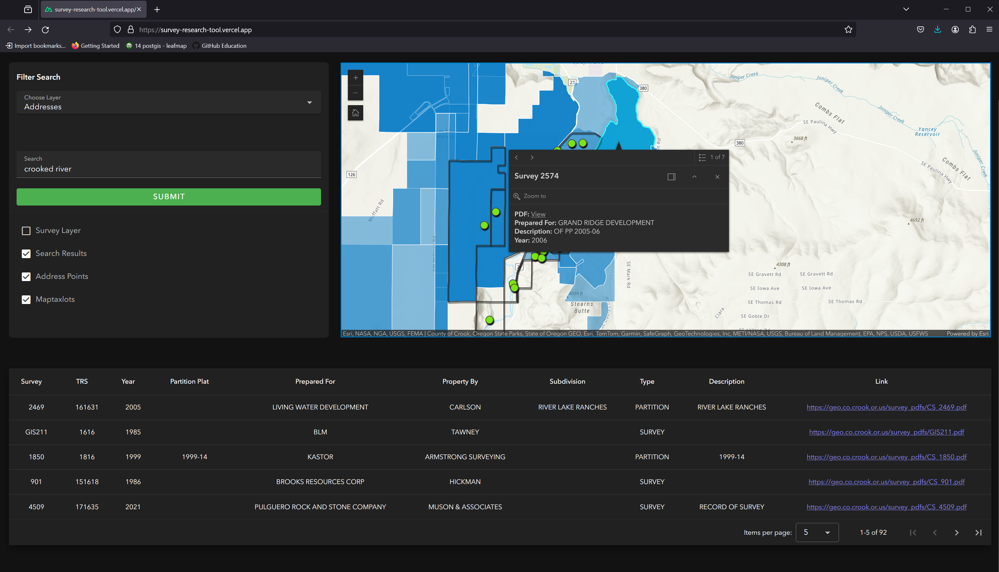

# Nuxt 3 / Vue Application - ArcGIS Maps SDK For JavaScript

### Available at: [https://survey-research-tool.vercel.app/](https://survey-research-tool.vercel.app/)

Look at the [Nuxt 3 documentation](https://nuxt.com/docs/getting-started/introduction) to learn more.

## Research Crook County's survey data with an interactive web application.

